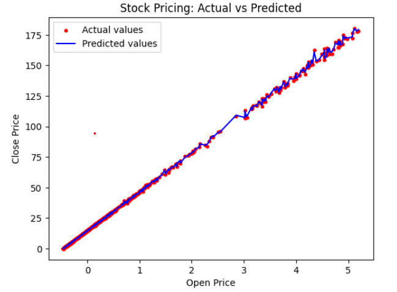

# Stock Price Predictor

## Description
The Stock Price Predictor is a machine learning project designed to predict the closing prices of stocks based on historical data. Using features such as opening price, highest price, lowest price, volume, and adjusted closing price, this model employs multiple linear regression to analyze trends and make predictions.

## Features
- Data Preprocessing: Handles missing values and scales features for better model performance.
- Model Training: Utilizes a multiple linear regression algorithm to learn from historical stock price data.
- Predictions: Generates predictions for stock closing prices based on input features.
- Visualization: Displays a comparison of actual vs predicted stock prices to evaluate model accuracy.

## Images


## Technologies Used
- Python
- Pandas
- NumPy
- Scikit-learn
- Matplotlib

## Installation
1. Clone the repository:
   ```bash
   git clone https://github.com/your-username/StockPricePredictor.git
2. Usage
    python stock_price_predictor.py
